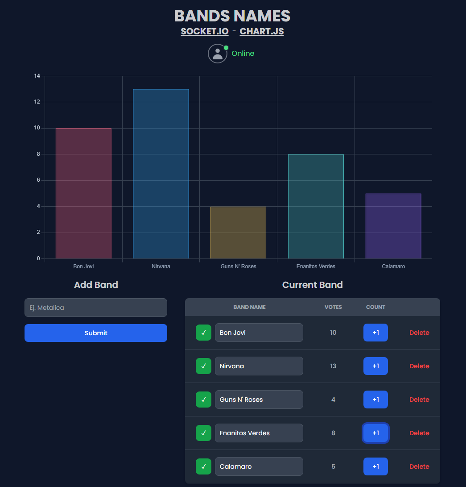

# SOCKET.IO - CHART.JS

<div>
  <h2>:desktop_computer: Desktop</h2>
  
</div>

## Technologies

- React
- Vite
- Typescript
- Chart.js
- Socket.io-client
- Tailwindcss

## Formatter

- Prettier

## Guide

Socket.io: [socket.io](https://socket.io/) <br/>
Chart.js: [chart.js](https://www.chartjs.org/)

## How To Use

To clone and run this application, you'll need Git and Node.js (which comes with yarn) installed on your computer. From your command line:

```bash
# Clone this repository
$ git clone https://github.com/kevin-sg/socket_fronted_practice_v1.git

# Install dependencies
$ yarn install

# Run the app
$ yarn dev
```
